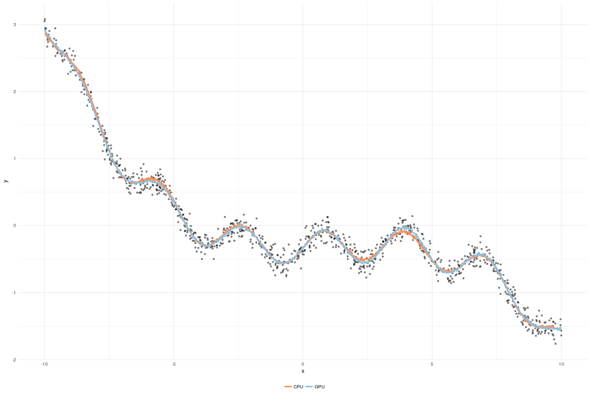

  
## Stan has access to GPUs

 - We see speedups of 8x for GPs with $N = 5000$
 - Parameter estimates retain precision $\left(10^{-14}\right)$
 - In production by July
 - GPUs + MPI + threading is very exciting!
 
## What do we have so far?

1. Matrix transpose
2. Multiplication of matrices with a diagonal and scalar
3. Addition/Subtraction of matrices
4. Copying submatrices
5. Matrix multiplication
6. Lower triangular matrix inverse
7. Cholesky decomposition
8. First derivative of Cholesky decomposition


## Hows it Work? - Inverse

- Calculate $A1$ and $A2$ inverse sequentially ($C1$ and $C2$)
$$
C3 = -C2 \times A3 \times C1
$$


- Blocking algorithm by (Mahfoudhi, 2012)

## Calculating A1 and A2 Inverse

- Calculate $A1_{A1}$ and $A1_{A2}$ inverse sequentially ($A1_{C1}$ and $A1_{C2}$)
$$
A1_{C3} = A1_{-C2} \times A1_{A3} \times A_{C1}
$$


## Hows it Work? - Cholesky

- Same as inverse, but only sequential for $A_{11}$
$$L_{21} = A_{21} (L_{11}^T)^{(-1)} \; \;\;\; \; L_{22} = A_{22} - L_{21} (L_{21})^T$$


- Blocking algorithm of (LouterNool, 1992)


## Example: 1D GP Regresssion

- Example from (Betancourt, 2017)
- Relationship between $x$ and $y$ with added Gaussian noise:

$$x_i \sim_{\text{iid}} U(-10,10)$$
$$y_i | x_i \sim_{\text{iid}} N \left( f(x), \frac{1}{10} \right), i = 1..n,$$
where 
$$f(x) = \beta(x + x^2 - x^3 + 100 \sin 2x - \alpha)$$

- Parameters $\beta$ and $\alpha$ s.t. $E[f] = 0$ and $Var[f] = 1$.

## Code Example

- Take Michael's code from his GP tutorial online
- replace

```
matrix[N1, N1] L_K = cholesky_decompose(K);
```
with
```
matrix[N1, N1] L_K = cholesky_decompose_gpu(K);
```

Pass compiler options:

```
STAN_OPENCL=true
OPENCL_DEVICE_ID=0
OPENCL_PLATFORM_ID=0
```

## How do the Samples Look?



- Pretty good!
- 500 warmup and 500 iterations

## But The Speed?


Nice!

## Results

- Things are fast and precise!
- We'll be wrapped up (hopefully) in July
- Email: sab2287@columbia.edu


## Bibliography

Mahfoudhi, Ryma et al. “High Performance Recursive Matrix Inversion for Multicore Architectures.” 2017 International Conference on High Performance Computing & Simulation (HPCS) (2017): 675-682.

Betancourt, Michael. "Robust Gaussian Processes In Stan, Part 3". Betanalpha.Github.Io, 2018, https://betanalpha.github.io/assets/case_studies/gp_part3/part3.html. 

Louter-Nool, Margreet. 1992. “Block-Cholesky for Parallel Processing.” Appl. Numer. Math. 10 (1). Amsterdam, The Netherlands, The Netherlands: Elsevier Science Publishers B. V.: 37–57. doi:10.1016/0168-9274(92)90054-H.

Slides/Paper/Code:

- https://github.com/SteveBronder/stancon2018/tree/r_in_finance